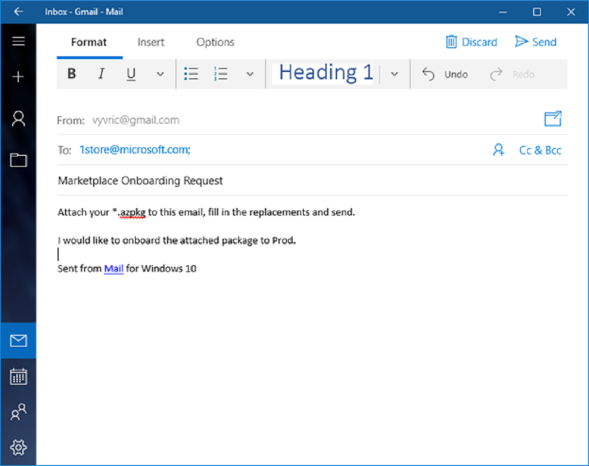
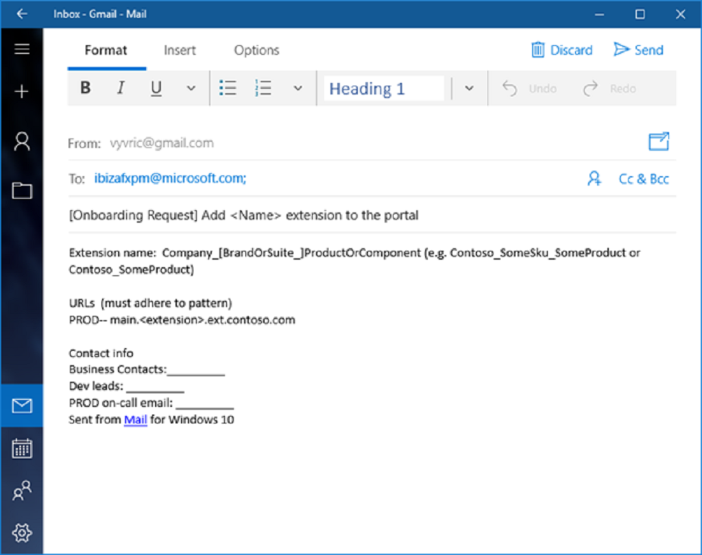

<a name="portalfxExtensionsForDevelopersProcedures"></a>
<!-- link to this document is [portalfx-extensions-forDevelopers-procedures.md]()
-->

## Development Procedures
To become an Azure Portal developer, you need to perform the following tasks.
1. Acquire the following permissions:
    * PMs and Developer Leads need to join the ibizapartners PM group by clicking on the link named [http://igroup/join/ibizapartners-pm](http://igroup/join/ibizapartners-pm). 
    * Developers should join the ibizapartners DEV group by clicking on the link named [http://igroup/join/ibizapartners-dev](http://igroup/join/ibizapartners-dev). 
    * Developers should join the Azure Portal Partner Contributors group by using [http://ramweb](http://ramweb).
    * Both groups should join the ibizabreak group by clicking on the link named [http://igroup/join/ibizabreak](http://igroup/join/ibizabreak) for notifications on breaking changes. 
    * Both groups should join Stackoverflow Forums that are located at  [https://stackoverflow.microsoft.com](https://stackoverflow.microsoft.com) to let us know if you have any questions. (Don't forget to tag questions with "ibiza" or related tag).
    *  Developers should join github groups from the site located at github.com.


1. Install the following software. Your team should be aware of the most current download locations so that you can complete your own installs.
    * Visual Studio that is located at [https://www.visualstudio.com/downloads/](https://www.visualstudio.com/downloads/)
    * Typescript for Visual Studio 17 that is located at [https://www.microsoft.com/en-us/download/details.aspx?id=55258](https://www.microsoft.com/en-us/download/details.aspx?id=55258)
    * Typescript for Visual Studio 15 that is located at [https://www.microsoft.com/en-us/download/details.aspx?id=48593](https://www.microsoft.com/en-us/download/details.aspx?id=48593)
    * Knockout that is located at [http://knockoutjs.com/downloads/](http://knockoutjs.com/downloads/)
    *	Azure Portal SDK that is located at [http://aka.ms/portalfx/download](http://aka.ms/portalfx/download)
    *	Quality Essentials that is located at [http://qe](http://qe)
    , or 1CS that is located at  [https://microsoft.sharepoint.com/teams/1CS/SitePages/Home.aspx](https://microsoft.sharepoint.com/teams/1CS/SitePages/Home.aspx)

1.	Attend the kickoff meeting(s) hosted by your PM or Dev Lead. These meetings will touch on the following points.
    * Whether the service will target public Azure, on-premises, or both
    * What is the name of the service
    * Summary of the service and target scenarios

    If you are planning to build a first party application, i.e., you are a part of Microsoft, the meeting agenda will also include:
    * VP, PM, and engineering owners
    * Timelines (preview, GA)

1.	Read the following documents from the Azure Portal UI team site.  Our doc site provides the technical guidance while you are building your extension.

    Function | Title and Link	
    --- | --- 
    Guidance for Program Managers and Dev Leads	 | Portal Extensions for Program Managers, located at [portalfx-extensions-forProgramManagers.md](portalfx-extensions-forProgramManagers.md)
    Private Preview, Public Preview, and GA  |	Portal Extension Development Phases, located at  [portalfx-extensions-developmentPhases.md](portalfx-extensions-developmentPhases.md)
    How it Works	 | How Extensions Work, located at [https://github.com/Azure/portaldocs/blob/master/portal-sdk/generated/index-portalfx-extension-development.md#getting-started](https://github.com/Azure/portaldocs/blob/master/portal-sdk/generated/index-portalfx-extension-development.md#getting-started)
    Build an empty extension  |	Creating An Extension, located at [https://github.com/Azure/portaldocs/blob/master/portal-sdk/generated/portalfx-creating-extensions.md#getting-started-with-the-portal-sdk](https://github.com/Azure/portaldocs/blob/master/portal-sdk/generated/portalfx-creating-extensions.md#getting-started-with-the-portal-sdk)
    Experiment with sample code	| Sample Extensions, located at [https://github.com/Azure/portaldocs/blob/master/portal-sdk/generated/portalfx-sample-extensions.md#samples-extension](https://github.com/Azure/portaldocs/blob/master/portal-sdk/generated/portalfx-sample-extensions.md#samples-extension)

1.	When you are ready to build the actual extension, you must also schedule a UX feasibility review. This allows time to time to review the design and ensure that the desired outcome is feasible. You can schedule this review by reaching out to ibiza-onboading-kickoff@microsoft.com and including “Extension Feasibility Review” in the subject line of the e-mail.
1.	If the extension requires additional built-in support for standard Graph or ARM APIs, you can submit a partner request at the site located at [https://feedback.azure.com/forums/594979-ibiza-partners](https://feedback.azure.com/forums/594979-ibiza-partners).
1. Complete the development and unit testing of the extension.
1.	When you build the extension, you should also side-load it for local testing. Side-loading allows you to test and debug your extension locally against any environment. This is the preferred method of testing. For more information about side-loading, see [https://github.com/Azure/portaldocs/blob/master/portal-sdk/generated/index-portalfx-extension-development.md#debugging-testing-in-production](https://github.com/Azure/portaldocs/blob/master/portal-sdk/generated/index-portalfx-extension-development.md#debugging-testing-in-production).
1.	When you are confident that your extension development is complete, you should execute the following process so the specific work required for the tenets appears in Service360.
    * Add the service to ServiceTree, which is located at [https://servicetree.msftcloudes.com](https://servicetree.msftcloudes.com)
    * Make the service be "Active" in ServiceTree
    * Complete metadata in ServiceTree to enable the automation for various Service360 Action Items
    * Complete the Action Items identified in Service360, which is located at [http://aka.ms/s360](http://aka.ms/s360)
1.	You should also address the exit criteria that must be met before the extension can be moved to the next development phase. The exit criteria are located at [https://github.com/Azure/portaldocs/blob/master/portal-sdk/generated/portalfx-onboarding-exitcriteria.md](https://github.com/Azure/portaldocs/blob/master/portal-sdk/generated/portalfx-onboarding-exitcriteria.md).

1. Create configuration files for your extension as specified in [portalfx-extensions-configuration.md](portalfx-extensions-configuration.md).

1. 	Integrate your extension into the Marketplace. 
In the following images, each icon in the Azure Portal Marketplace is referred to as a Gallery item. Gallery items take the form of a file with the .azpkg extension. You can think of this file as a zip which contains all assets for your gallery item: icons, screenshots, descriptions.

    

    * **PROD:** The Marketplace team accepts fully finished .azkpg files from your team and performs upload to Production To onboard your gallery package, send the following email to 1store@microsoft.com.  The subject line should contain “Marketplace Onboarding Request” and the *.azpkg file should be attached to the email, as in the following image.

        

    * **DOGFOOD:** Use AzureGallery.exe to upload items to DOGFOOD using the following command:

        ```AzureGallery.exe upload -p ..\path\to\package.azpkg -h [optional hide key]```

    In order to use the gallery loader you will need to set some values in the AzureGallery.exe.config file. For more information, see the Gallery Item Specifications document that is located at [https://github.com/Azure/portaldocs/blob/master/gallery-sdk/generated/index-gallery.md#gallery-item-specificiations](https://github.com/Azure/portaldocs/blob/master/gallery-sdk/generated/index-gallery.md#gallery-item-specificiations).  


    For more dev/test scenarios see the Testing in Production document that is located at [https://github.com/Azure/portaldocs/blob/master/gallery-sdk/generated/index-gallery.md#gallery-package-development-and-debugging-testing-in-production](https://github.com/Azure/portaldocs/blob/master/gallery-sdk/generated/index-gallery.md#gallery-package-development-and-debugging-testing-in-production).

1.	Once your service name is finalized, request to have your extension registered in all environments. Registering an extension in Portal requires deployment so it can take almost 10 days. Please plan accordingly.

    * The request to register your extension, for internal applications, is located at                   . It should be completed and emailed to ibizafxpm@microsoft.com, with the phrase ‘Register extension’ in the subject line. You'll automatically be notified when the configuration change is pushed to PROD. External teams can submit their request by sending an  email that resembles the following image.

        
 

    * Once deployed to DOGFOOD (DF), contact the Fx team to request that they enable the extension, if applicable. Every extension must meet required exit criteria / quality metrics before it will be enabled. Your extension will be enabled in production once all exit criteria have been met.

        Extension names must use standard extension name format, as in the example [the extensionPdl file](portalfx-extensions-configuration-overview.md#extensionPdl)
         that is located at
        [portalfx-extensions-configuration-overview](portalfx-extensions-configuration-overview.md).


    * Extension URLs must use a standard CNAME pattern. For more information about CNAMES, see [portalfx-extensions-cname-patterns.md](portalfx-extensions-cname-patterns.md).

    * Use a wildcard SSL cert for each environment to simplify maintenance, for example,   ``` *.{extension}.onecloud-ext.azure-test.net  ``` or  ``` *.{extension}.ext.azure.com) ``` . 
   To simplify overall management when your team is building separate, independent extensions, you can also use  ``` {extension}.{team}.ext.azure.com ``` and create a wildcard SSL cert for  ``` *.{team}.ext.azure.com ```. Internal teams can create SSL certs for DogFood using the SSL Administration Web page that is located at [http://ssladmin](http://ssladmin). 
    
        Production certs must follow your organization’s PROD cert process. 

        NOTE: Do not use the SSL Admin site for production certs.


